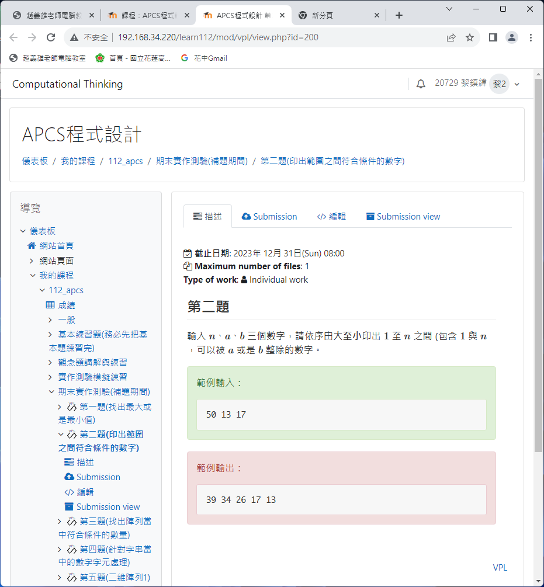
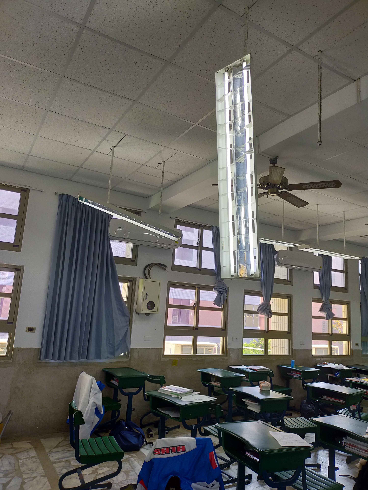
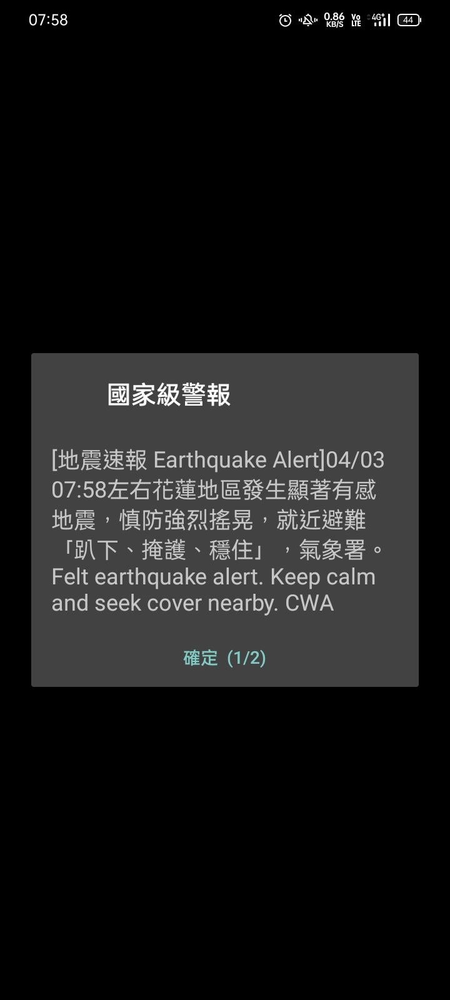
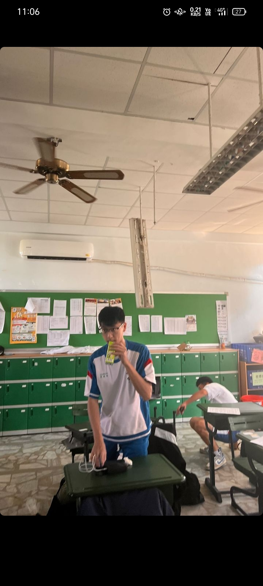
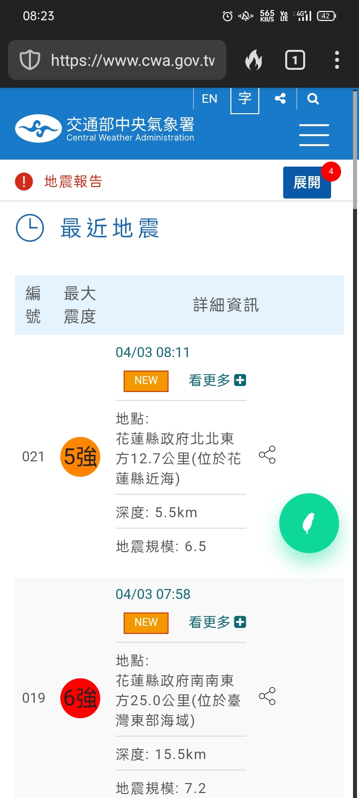

# APCS練習用檔案

用來當作歷程檔案，是上課時練習的內容

上課考試題目長這樣，可以參考

千萬不要暴力破解，老師看的到你寫的鬼東西

  
   

.

.

.

.

.

.

.

# 0403地震

那是一個平凡的清晨，我到學校補眠至快上課時，後面玩遊戲的談話聲跟往常一樣大聲，各種噪音加上熱天氣使我開始煩躁。這時，有同學說"地震"，我就立刻清醒，並站起來確認情況(確保不是同學搞事)。果不其然，地板在晃動，但是情況似乎不對勁--晃動程度似乎比平常大，頓時各種碰撞聲開始出現，燈具都垂下來了，連在地的花蓮人都開始感到恐懼。

  
   

頃刻警鈴大作，所有人的手機都在大聲地警示，後續更發布海嘯警報，全校開始疏散並聚集至小操場，剛要上課就準備停課

  
   

慣性遲到的自然還在路上，班導先打電話確定同學是活的，有些比較晚到的在班上先吃早餐再避難

  
   

最後回來收東西時還順便大合照報平安，這時仍有餘震發生

  
   

圖片是氣象局官網內容，並造成兩棟大樓倒塌，新增幾件危樓並帶走數人性命

  
   

